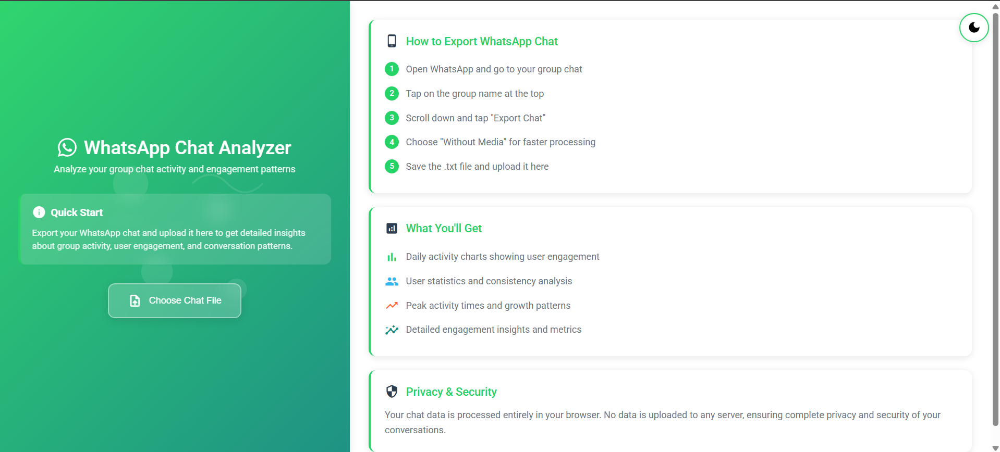
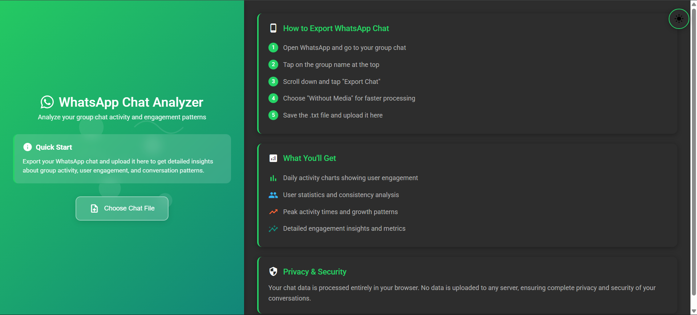
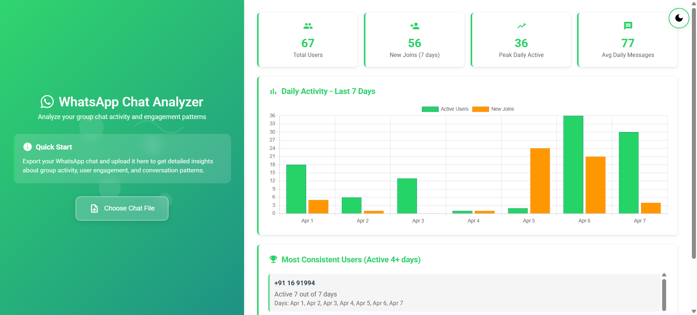
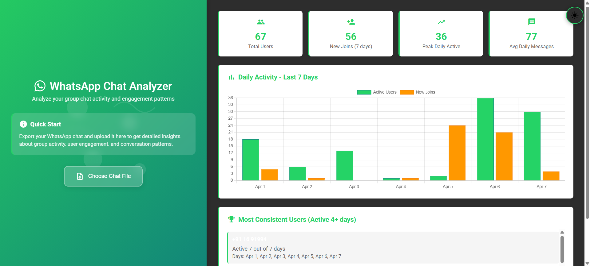

# 📱 WhatsApp Chat Analyzer

<div align="center">


*Light Mode Interface*


*Dark Mode Interface*

</div>

A modern web-based tool to analyze WhatsApp group chat activity and engagement patterns. Built with vanilla JavaScript, Chart.js, and Node.js featuring a beautiful Material Design interface with dark mode support.

## ✨ Key Features

🎨 **Modern Material Design UI** - Clean, responsive interface with WhatsApp branding  
🌙 **Dark/Light Mode Toggle** - Persistent theme preference with smooth transitions  
📊 **Interactive Analytics** - Real-time charts and statistical insights  
🔒 **Privacy-First** - All processing happens in your browser  
📱 **Fully Responsive** - Works perfectly on desktop, tablet, and mobile  
⚡ **Lightning Fast** - Instant analysis with no server uploads

### 📊 **Analytics & Insights**
- **Daily Activity Analysis**: Track active users and new joins over the last 7 days
- **Interactive Charts**: Beautiful bar charts with WhatsApp-themed colors
- **Consistent User Detection**: Identify users active for 4+ days in the analyzed period
- **Statistical Cards**: Total users, new joins, peak activity, and average messages
- **User Engagement Metrics**: Detailed breakdown of user participation patterns

### 🎨 **Modern UI/UX**
- **Material Design Interface**: Clean, professional dashboard-style layout
- **Dark Mode Support**: Toggle between light and dark themes with persistent preference
- **WhatsApp Branding**: Authentic WhatsApp colors and official logo
- **Chat-Themed Background**: Beautiful SVG patterns representing messaging
- **Responsive Design**: Optimized for desktop, tablet, and mobile devices
- **Glass-morphism Effects**: Modern backdrop blur and transparency effects

### 🔒 **Privacy & Performance**
- **Client-side Processing**: All analysis happens in your browser - no data uploads
- **Real-time Analysis**: Instant results with loading animations
- **Error Handling**: Robust parsing with helpful error messages
- **File Format Support**: Multiple WhatsApp export formats supported

## 🚀 Quick Start

```bash
# Clone the repository
git clone https://github.com/Sammed-NJ/whatsapp-chat-analyzer.git
cd whatsapp-chat-analyzer

# Start the server
npm start

# Open browser
# Go to http://localhost:3000
```

### 📱 How to Export WhatsApp Chat

1. **Open WhatsApp** → Go to your group chat
2. **Tap group name** → Scroll to "Export Chat"
3. **Choose "Without Media"** → Save the .txt file
4. **Upload to analyzer** → Get instant insights!

<div align="center">


*Detailed Analytics Dashboard*

</div>

## 📊 What You'll Get

| Feature | Description |
|---------|-------------|
| 📈 **Daily Activity Charts** | Interactive bar charts showing user engagement patterns |
| 📋 **Statistical Dashboard** | Key metrics: total users, new joins, peak activity |
| 🏆 **Consistency Analysis** | Identify most active users (4+ days activity) |
| 🕰️ **7-Day Insights** | Automatic analysis of recent chat activity |
| 🎨 **Beautiful UI** | Material Design with WhatsApp authentic styling |

<div align="center">


*Dark Mode Analytics View*

</div>

## 🎨 Design & Technology

### 🎨 **Modern Design System**
- **Material Design 3** principles with WhatsApp branding
- **Responsive Grid Layout** (35% sidebar, 65% content)
- **Glass-morphism Effects** with backdrop blur
- **Smooth Animations** and micro-interactions

### 🛠️ **Tech Stack**
- **Frontend**: Vanilla JavaScript, HTML5, CSS3
- **Charts**: Chart.js for interactive visualizations  
- **Server**: Node.js with static file serving
- **Icons**: Google Material Icons
- **Fonts**: Roboto (Google Fonts)

### 🎨 **Color Palette**
```css
--primary-color: #25D366    /* WhatsApp Green */
--secondary-color: #34B7F1  /* Blue */
--accent-color: #FF6B35     /* Orange */
```

## 🔧 Advanced Usage

<details>
<summary><strong>🛠️ Customization Options</strong></summary>

### Modify Analysis Period
```javascript
// Change from 7 days to 14 days in analyzer.js
startDate.setDate(startDate.getDate() - 13);
```

### Adjust Consistency Threshold
```javascript
// Change from 4+ days to 3+ days
.filter(([user, activeDays]) => activeDays.size >= 3)
```

### Custom Theme Colors
```css
:root {
    --primary-color: #your-color;
    --secondary-color: #your-color;
}
```

</details>

<details>
<summary><strong>🐛 Troubleshooting</strong></summary>

| Issue | Solution |
|-------|----------|
| Button not working | Enable JavaScript, refresh page |
| No messages found | Check .txt format, verify export |
| Chart not showing | Check console, verify Chart.js loading |
| Dark mode not saving | Enable localStorage, clear cache |

</details>

## 🚀 Future Roadmap

- [ ] **Advanced Analytics**: Sentiment analysis, word clouds, peak hours
- [ ] **Export Features**: PDF reports, CSV data export
- [ ] **Multi-language**: Internationalization support
- [ ] **Media Analysis**: Photo/video sharing patterns
- [ ] **Comparison Tools**: Multi-period analysis
- [ ] **Advanced Charts**: Heatmaps, network graphs, timelines

## 🤝 Contributing

Contributions welcome! Check out these areas:
- 📈 Additional chart types and visualizations
- 📊 Enhanced user statistics and metrics  
- ⚡ Performance optimizations
- ♿ Accessibility improvements
- 📱 Mobile app version

## 📝 License

MIT License - feel free to use and modify!

---

<div align="center">

**Built with ❤️ for better chat insights**

*Featuring Material Design, Dark Mode, and WhatsApp-authentic styling*

[](https://github.com/Sammed-NJ/whatsapp-chat-analyzer)
[](https://github.com/Sammed-NJ/whatsapp-chat-analyzer)

</div>